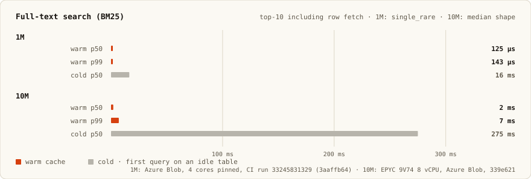
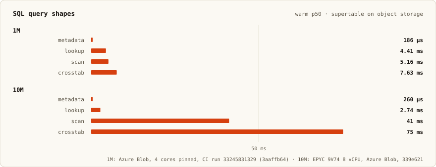
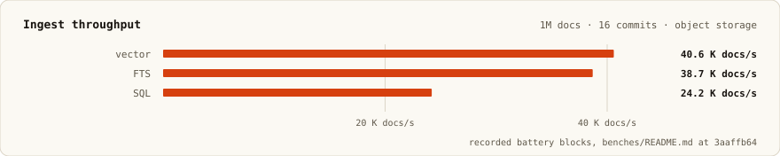
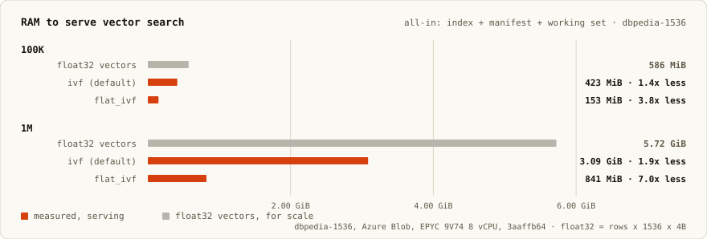
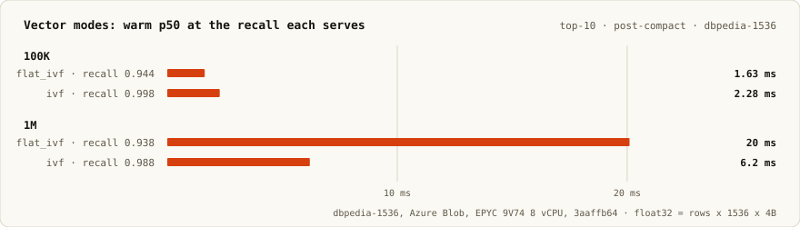
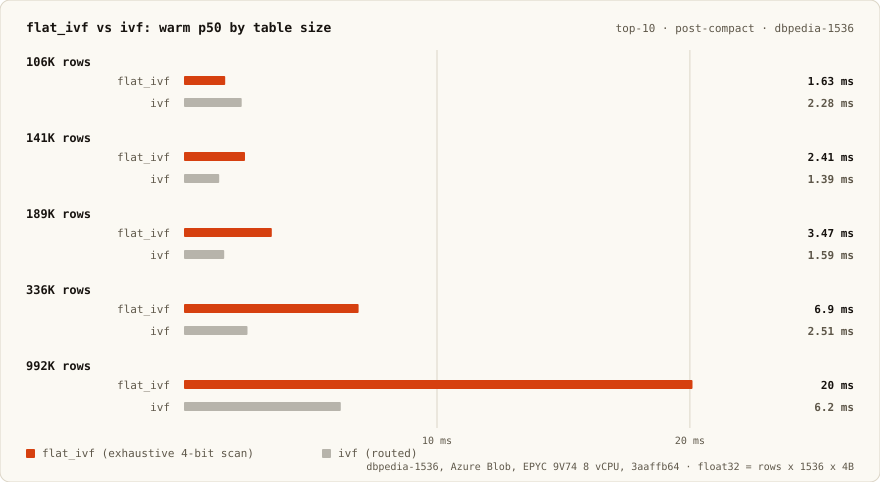
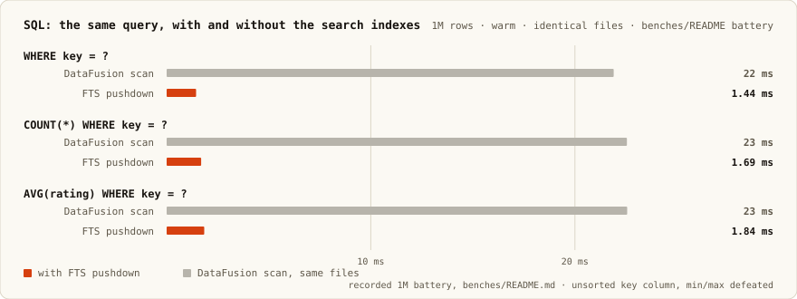

# Infino

[](https://deepwiki.com/infino-ai/infino)
[](https://crates.io/crates/infino)
[](https://docs.rs/infino)
[](https://github.com/infino-ai/infino/actions/workflows/ci.yml)
[](LICENSE)

**Infino is a fast embedded retrieval library: full-text, vector, hybrid, and SQL over one table, stored as
ordinary Parquet on local disk or object storage. Simple, scalable, and optimized for cost.**

```sh
pip install infino              # Python
npm install @infino-ai/infino   # Node.js
cargo add infino                # Rust

or in Cargo.toml:

[dependencies]
infino = "0.5"
```

Note: infino installs the [mimalloc](https://github.com/microsoft/mimalloc)
global allocator by default. If you embed infino in a process that already
sets a global allocator, turn it off to avoid a second one:
`infino = { version = "0.5", default-features = false }`.

## Quickstart

```python
import infino
import pyarrow as pa

db = infino.connect("memory://")

schema = pa.schema([
    pa.field("body", pa.large_utf8(), nullable=False),
    pa.field("embedding", pa.list_(pa.float32(), 384), nullable=False),
])
docs = db.create_table(
    "docs", schema,
    infino.IndexSpec().fts("body").vector("embedding", 384, "cosine"),
)

docs.append(rows)   # list of dicts, or an Arrow RecordBatch

# BM25 and vector in one call, fused ranking. `query_vec` is your embedding.
hits = docs.hybrid_search("body", "disk full", "embedding", query_vec, k=10)
```

## Performance

Warm p50, tables on object storage:

| | 1M docs | 10M docs |
|---|---|---|
| Vector top-10 (recall@10 0.992 at 1M) | 591 µs | 5 ms |
| BM25 top-10, including row fetch | 125 µs | 2 ms |
| SQL, metadata → crosstab shapes | 186 µs – 7.6 ms | 260 µs – 75 ms |

Every battery's full recorded tables — per-shape rows, RSS, cold GET counts, the 1M
run these summaries quote — live in [benches/README.md](benches/README.md).


<details>
<summary>Reproduce</summary>

```sh
cargo bench -- supertable vector warm cold
```

Bare `cargo bench` runs the 10M tier; the 1M rows (what CI runs) are
`INFINO_BENCH_SUPERTABLE_DOCS=1000000` prefixed to the same command.
</details>



<details>
<summary>Reproduce</summary>

```sh
cargo bench -- supertable fts warm cold
```

Bare `cargo bench` runs the 10M tier; the 1M rows (what CI runs) are
`INFINO_BENCH_SUPERTABLE_DOCS=1000000` prefixed to the same command.
</details>



<details>
<summary>Reproduce</summary>

```sh
cargo bench -- supertable sql warm
```

Bare `cargo bench` runs the 10M tier; the 1M rows (what CI runs) are
`INFINO_BENCH_SUPERTABLE_DOCS=1000000` prefixed to the same command.
</details>



<details>
<summary>Reproduce</summary>

```sh
INFINO_BENCH_SUPERTABLE_DOCS=1000000 cargo bench -- supertable build
```

One command, all three modalities' ingest cells.
</details>

- Cold first query = file opens + cache fill: 114 ms (1M) and 314 ms (10M) for vector,
  16 ms and 275 ms for BM25. Warm and cold sit ~200× apart; the charts use a log scale.
- 1M: CI — Azure Blob, 4 pinned cores, commit `3aaffb64`
  ([run 33245831329](https://github.com/infino-ai/infino/actions/runs/33245831329)).
- 10M: same harness at its default scale — 8-vCPU AMD EPYC 9V74 (AVX-512, 62 GiB),
  Azure Blob, commit `339e621`. Compare each scale against its own baseline.

<details>
<summary><b>Methodology: config, real corpora, matching CI</b></summary>

Engine behavior is configured in YAML only; environment variables never override it. The
shipped defaults are what the charts measure:

```sh
cp src/config/config.yaml infino.yaml    # or $XDG_CONFIG_HOME/infino/config.yaml
```

The `vector:` block holds probe depth, rerank codec, and cell counts. The `supertable:`
block holds commit and cache behavior. Leave both alone to reproduce the published charts.

Corpus size is the one bench knob that reads an environment variable, and it takes a plain
integer (`1000000`, not `1M`); each chart's own Reproduce fold carries its exact command.

To run against a real dataset instead of the synthetic corpus, pass a `corpus=` spec.
It applies to one selected cell, so name a single tier and modality:

```sh
# Hugging Face parquet dataset — downloaded once into corpus-dir, reused after
INFINO_BENCH_SUPERTABLE_DOCS=1000000 \
  cargo bench -- supertable vector \
  corpus=hf:KShivendu/dbpedia-entities-openai-1M corpus-dir=./corpora

# Any local parquet shards (e.g. Cohere embeddings you already hold)
cargo bench -- supertable vector corpus=parquet:/path/to/shards
```

`INFINO_BENCH_SUPERTABLE_DOCS` caps how many rows are ingested from the dataset. Recall is
graded against brute-force exact ground truth on held-out queries, real corpus or synthetic.

That runs against a local RustFS daemon, an HTTPS S3 stand-in, by default. To match CI:

```sh
INFINO_BENCH_SUPERTABLE_DOCS=1000000 \
INFINO_BENCH_STORE=azure \
INFINO_REAL_AZURE_CONTAINER=$CONTAINER \
AZURE_STORAGE_ACCOUNT_NAME=$ACCOUNT \
AZURE_STORAGE_ACCOUNT_KEY=$KEY \
  cargo bench -- supertable vector warm cold
```

Reading the output: vector is the post-drain `default` row; BM25 is `single_rare` under
Supertable FTS; the SQL shapes are `agg_max_title` (metadata), `WHERE key = ?` (lookup),
`AVG(rating) GROUP BY category` (scan), and `COUNT(*) GROUP BY bucket, category`
(crosstab). Structured results land in `target/infino-bench/*.json`. Methodology is in
[benches/README.md](benches/README.md).

</details>

### Against other engines


[VectorDBBench](https://zilliz.com/vdbbench-leaderboard?dataset=vectorSearch)
([Repro](https://github.com/infino-ai/retrievalbench))


[RetrievalBench](https://github.com/infino-ai/retrievalbench)([Repro](https://github.com/infino-ai/retrievalbench))


[Search Benchmark, the Game](https://tantivy-search.github.io/bench/)
([Repro](https://github.com/infino-ai/search-benchmark-game))


[ClickBench](https://benchmark.clickhouse.com/#system=+ClickHouse%7CDuckDB%7CInfino%7CDataFusion%20%28Parquet%2C%20single%29&machine=+c6a.4xlarge&cluster_size=-&type=-&metric=hot)
([Repro](https://github.com/infino-ai/retrievalbench))


[ClickBench](https://benchmark.clickhouse.com/#system=-&type=+sac&machine=+c6a.4xlarge&cluster_size=-&opensource=-&hardware=+c&tuned=+n&metric=hot&queries=-)
([Repro](https://github.com/infino-ai/retrievalbench))

## How it works


### Summary

- One Parquet file per data batch, with the BM25 and vector indexes inside it.
  DuckDB, pyarrow, and DataFusion open the same file as a normal table
  ([example](infino-python/examples/parquet_interop.py)).
- The storage target is determined by a connection string: `memory://`, a local path, or
  `s3://`, `gs://`, Azure.
- No daemon, no cluster, no lock service is necessary. Infino writes append-only, immutable
  files so readers pin a snapshot and never block on writers.
- Tables much larger than RAM work: queries read byte ranges.

### The indexes live inside the Parquet file

- Each write produces one Parquet file with the BM25 and vector indexes embedded in it.
- Any Parquet reader — DuckDB, pyarrow, DataFusion — opens that file and sees a normal
  table. Infino opens the same file and also finds its indexes.
- There is no separate index artifact to build, ship, or keep in sync, and nothing to load
  at startup.

### A query reads byte ranges, not files

- The indexes are sorted by term and by vector cluster, so a top-10 turns into a short list
  of byte offsets. On object storage, that is a few HTTP range requests, not a download.
- One object-store request takes 20–100 ms.
- Fetched ranges are kept in a local disk cache and memory-mapped. A repeated query makes
  zero network requests and answers in 125 µs.
- The cache shrinks under memory pressure and empties on an idle table. Queries refill it.

### The text scorer is picked per query

Posting lists store, for each term, how many documents contain it and the best possible
score in each block. With that on hand, the engine picks the cheapest correct algorithm for
each query:

- A query mixing a rare word and a common word skips through the common word's list instead
  of reading it (WAND / Block-Max WAND).
- A query of comparably common words scores documents in fixed-size windows, dropping words
  that can no longer reach the top 10 as the threshold rises (MaxScore).
- Counting matches for a query dominated by one very common word reads a stored count
  instead of walking the posting list.
- Very dense queries switch to bitsets. Very sparse ANDs walk the shortest list and probe
  the others.
- The switch points were set by benchmark, and every algorithm is tested against a
  brute-force BM25 implementation. The choice changes speed, never results.

### Vector search is a three-stage funnel

- Vectors are grouped into clusters. A query is compared to the cluster centers first, and
  only the nearest clusters are read — 62 of 255, for a top-10 on a 1M-row table.
- Rows in those clusters are scored with 1-bit-per-dimension codes: 192 bytes per
  1536-dimension vector, instead of 6 KiB as float32.
- The best candidates — 155 rows for that same top-10 — are re-scored with
  2-byte-per-dimension codes to get the exact order.
- How many clusters to read and how many rows to re-score are measured per table when the
  index is built, and measured again when the data changes shape.
- Measured recall@10 at 1M rows: 0.992, tested against exact brute-force nearest neighbors.
- Distance kernels are runtime-dispatched: AVX-512, AVX2, a portable 256-bit path, and an
  int8 VNNI kernel for graph navigation.

### Commits swap a manifest

- A table is a set of immutable files plus a manifest that lists them. A commit writes new
  files, then replaces the manifest in one atomic step: all of its rows appear, or none.
- A reader keeps the manifest it opened and finishes on that version. It never waits on a
  writer and never sees half a commit.
- No lock service, no leader election.

### `optimize()` fits the index to the data

- You set one number — `target_recall: 0.99`. `optimize()` measures the table and sizes
  everything else: how many clusters, how many a query reads, how many rows get re-scored.
- If you select the graph or flat index mode, it is built and its recall is measured. It
  serves only if it reaches the bar on this data; otherwise the default index keeps serving
  and nothing changes for the caller.
- The measurements are redone whenever compaction or a cluster split changes the data.

```yaml
# infino.yaml
vector:
  target_recall: 0.99
  search_mode: ivf         # ivf (default) | hnsw_ivf | flat_ivf
```

```python
table.optimize()    # drain, compact, recalibrate, sweep
```

Every knob, and the measurement behind each default, is documented inline in
[`src/config/config.yaml`](src/config/config.yaml).

## Vector index modes

You can trade memory for latency, depending on your workload.

A million 1536-dimension vectors are 5.7 GiB of RAM as float32. `flat_ivf` serves them from
841 MiB, all-in.



<details>
<summary>Reproduce</summary>

```sh
printf 'vector:\n  search_mode: flat_ivf\n' > infino.yaml   # or hnsw_ivf; rm for ivf
INFINO_BENCH_SUPERTABLE_DOCS=1000000 \\
  cargo bench -- supertable vector build warm \\
  corpus=hf:KShivendu/dbpedia-entities-openai-1M corpus-dir=./corpora
```

One run per mode: the config line selects it, `optimize()` builds it, the battery reports serving RSS and latency.
</details>





<details>
<summary>Reproduce</summary>

```sh
printf 'vector:\n  search_mode: flat_ivf\n' > infino.yaml   # or hnsw_ivf; rm for ivf
INFINO_BENCH_SUPERTABLE_DOCS=1000000 \\
  cargo bench -- supertable vector build warm \\
  corpus=hf:KShivendu/dbpedia-entities-openai-1M corpus-dir=./corpora
```

One run per mode: the config line selects it, `optimize()` builds it, the battery reports serving RSS and latency.
</details>

Measured serving figures, each row on its own corpus:

| Mode | Corpus | RAM to serve | recall@10 | warm p50 |
|---|---|---|---|---|
| `flat_ivf` | dbpedia 1M × 1536d | 841 MiB, pinned | 0.938 | 20 ms |
| `ivf` (default) | dbpedia 1M × 1536d | 3.16 GiB working set, 109 MiB pinned | 0.988 | 6.2 ms |
| `hnsw_ivf` | Cohere 1M × 768d | 2.5 GiB, pinned | 0.995 | 0.59 ms |

- `flat_ivf` — exhaustive scan over a 4-bit plane; no clusters, no graph, no rerank plane.
  Fetches nothing to serve, so cold equals warm and the quoted latency is a worst case.
  Linear in rows: 1.6 ms at 100K, 20 ms at 1M. Recall is codec-set (~0.94) and does not
  move with scale. Faster than the routed path below ~130K rows (chart above). Cosine only.
- `ivf` (default) — the only mode that scales past RAM. The index lives on object storage
  and pages through the reclaimable cache; pinned memory stays near 100 MiB at any scale.
- `hnsw_ivf` — graph walk on an int8 plane, exact re-rank on the final beam. Needs the graph
  resident, which bounds it to ~10M rows.
- Every mode falls back to the routed scan when it cannot serve a query; changing the mode
  can cost recall or latency, never correctness.

## SQL

SQL planning and execution is Apache DataFusion. Infino leverages the indexes it maintains for FTS
to accelerate SQL queries by pruning bytes it does not need to touch. For example, DataFusion
prunes ordered, numeric columns via min/max limits, but Infino uses Bloomfilters, FSTs, bitmaps,
and other data structures not usually available in DataFusion. For example, when a `WHERE` clause 
hits a column that has a full-text index, Infino looks the value up in that index first and hands DataFusion
the matching row numbers, so the scan decodes only those rows instead of the whole column.

The chart is that lookup switched on and off — same query, same files:



<details>
<summary>Reproduce</summary>

```sh
INFINO_BENCH_SUPERTABLE_DOCS=1000000 cargo bench -- supertable sql warm
```

The battery emits both arms — the same query through the index lookup and through the plain scan.
</details>

- Equality on an unsorted column, where Parquet min/max stats can't skip anything:
  21.9 ms without the index lookup, 1.44 ms with it. COUNT and AVG over the same
  predicate: ~22.5 ms → ~1.8 ms.
- Before any of that, per-file min/max, Bloom, and term summaries drop whole files, and an
  aggregate fully answered by the table's statistics never scans at all.

## Hybrid Search

The combination of SQL and search functions makes it simpler to express complex queries.
`bm25_search`, `vector_search`, `hybrid_search`, `token_match`, and `exact_match` are SQL
table-valued functions that let search results compose as ordinary SQL tables. 

The ranked result sets are relations so operations like retrieval, filters, joins,
and aggregation compose in one statement against one pinned snapshot. 

```sql
SELECT   _id, title, score
FROM     hybrid_search(                       -- FTS + vector, fused by RRF
           'logs', 'body', 'disk full',       --   the text side
           'embedding', :q, 50                --   the vector side, top 50
         )
WHERE    level = 'error'                      -- pushed-down filter
  AND    ts > now() - interval '24 hours'     -- on the same pass
ORDER BY score DESC                           -- one fused ranking
LIMIT    10;
```

Follow-up questions can stay in SQL, inline in the same query. 
Getting from “find disk-full errors” to “which team had them” takes a single query.

```sql
SELECT   s.team,
         count(*)      AS hits,
         avg(h.score)  AS relevance
FROM     hybrid_search('logs', 'body', 'disk full', 'embedding', :q, 1000) AS h
JOIN     services s ON s.id = h.service_id
WHERE    h.ts > now() - interval '7 days'
GROUP BY s.team
ORDER BY hits DESC;
```


## Limitations

- Tables are append-only and time-ordered. Updates are delete plus insert via tombstones, and
  there are no cross-table transactions. This is not an OLTP store.
- Writes go through a single writer slot, so there is one writer per table at a time. Readers
  are unbounded and are never blocked.
- This is a library with a SQL and Arrow surface. There is no daemon, no REST endpoint, and no
  cluster to operate.

The crate is 0.x and the API can still move. The public surface is pinned by `public-api.txt`.

## Building an agent?

Infino is a powerful agent data layer. Hybrid search and SQL allow more expressive
queries in more compact form, with less token spend on LLMs — for example in
[code-context](https://github.com/infino-ai/code-context), our Claude Code plugin.
Use for agent data exhaust, storing corpora for searching, or agent memory. 
Transcripts, embeddings, and metadata can be stored in one table, recalled by meaning, 
keyword, or SQL — in memory or over object storage, with no service to run:

- [infino-mcp](https://github.com/infino-ai/infino-mcp) — give any MCP client (Claude Code,
  Claude Desktop, Cursor, VS Code) keyword, semantic, hybrid, and SQL retrieval over your
  tables. Local embedding model, read-only by default, writes behind one flag.
  `npm i @infino-ai/mcp-server`, or straight from the MCP Registry.
- [infino-cli](https://github.com/infino-ai/infino-cli) — the same tables from your shell:
  SQL, full-text, and vector search against a path or bucket. Inspect what the agent
  stored, script the parts that don't need a model.
- [infino-analytics](https://github.com/infino-ai/infino-analytics) — a reference kit for
  building analytics products on Infino: visualization and dashboard API, plus Fino, a
  conversational layer — a complete worked example of an agent over Infino tables.

## Documentation

- [Overview](docs/architecture/overview.md) — the mental model, and how this compares
- [Superfile format](docs/architecture/superfile.md) — how indexes fit inside Parquet
- [Supertable layer](docs/architecture/supertable.md) — manifest, commit, query fan-out
- [infino.ai/docs](https://infino.ai/docs) — concepts and guides

| Language | Package | Examples |
|----------|---------|----------|
| Python | [infino-python/](infino-python/) | [examples/](infino-python/examples/) |
| Node.js | [infino-node/](infino-node/) | [examples/](infino-node/examples/) |
| Rust | [docs.rs/infino](https://docs.rs/infino) | [examples/](examples/) |

## Development

```sh
git clone git@github.com:infino-ai/infino.git && cd infino
cargo build
cargo run --example demo
make ci                # gates before a PR
make readme-charts     # regenerate the charts above
```

MSRV 1.95. Python and Node version on their own SemVer lines
([docs/versioning.md](docs/versioning.md)). See [CONTRIBUTING.md](CONTRIBUTING.md).
Licensed [Apache-2.0](LICENSE).
