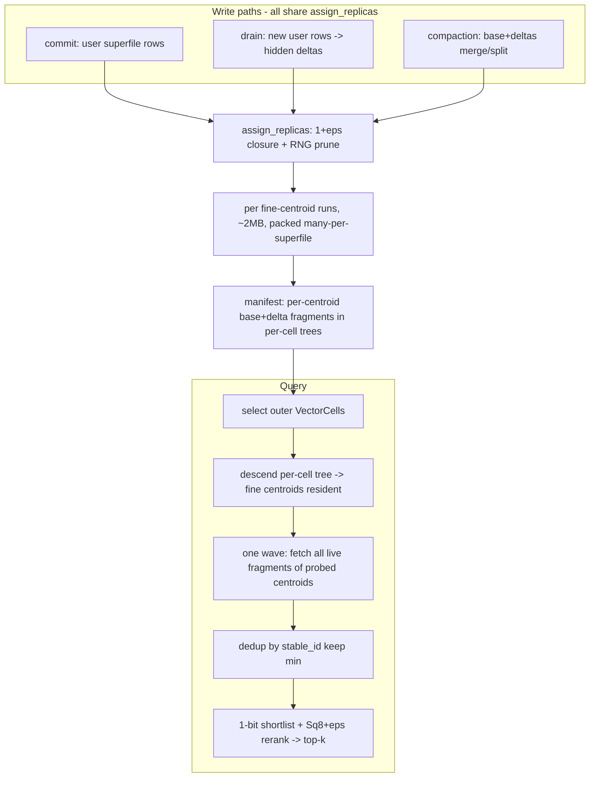

# OPANN Recovery Plan

Status: **design/spec**. This document is the implementation plan for the
hidden vector index (SPANN + SPFresh on immutable superfiles), after auditing
the current codebase.

The thesis, restated so it is not dropped again: this is turbopuffer on
Parquet. SPANN + SPFresh routing, expressed on immutable superfiles with an
MVCC manifest. "SPFresh" is not a blob layout. It is an
assignment-and-maintenance discipline. The blob is the easy part; the algorithm
is the point.

## What the current branch actually is (diagnosis)

The shipped `VectorLayout::Spfresh` is a runs-with-Sq8+eps subsection plus
manifest run refs and a cell-sharded drain/compaction. Historically this began
as hard-assignment IVF in new bytes. The SPFresh/SPANN invariants that make
low-nprobe recall work are being restored:

- **Assignment** must be replicated `(1+eps)` closure everywhere rows are
  written — commit (`fp32_rows_to_runs`), drain
  (`assign_fine_clusters` + `apply_fine_replication`), and compaction. No path
  writes a row to exactly one home.
- **Runs** must key on a **fine centroid** at a ~2 MB target
  (`TARGET_RUN_BYTES`), with `K_fine` scaling with N — never the fixed 64-cell
  grid. The 64 outer `VectorCell`s stay as the coarse cost-only pre-router.
- **Query** dedups by `stable_id` (min distance) because replicas put the same
  row in several runs.

## What to KEEP (correct, do not churn)

- Per-cell routing-tree manifest scaffolding: `SpfreshRoutingIndex`, `CellTree`,
  `CellTreeNode`, `RunRef` in `src/supertable/manifest/list.rs`, and
  `with_spfresh_routing` / `get_spfresh_routing` in
  `src/supertable/manifest/mod.rs`. Two-level routing (outer `VectorCell` ->
  per-cell tree -> runs) is the intended shape.
- Superfile envelope, `SubsectionOffsets`, reader-cache/open path, MVCC commit
  (`persist_commit_async` / `try_commit_attempt`), GC, `drained_ranges`, and the
  undrained user-tail query merge (`undrained_user_superfiles`).
- Codecs: Sq8+eps (`Sq8ResidualEpsilonKernel`,
  `materialize_sq8_residual_row_into_cluster_quant`), 1-bit RaBitQ
  pass-through, per-run quantizer derivation.
- The SPFresh blob's byte framing (header + run directory + row payload). It is
  a fine substrate; it carries replicated rows and per-centroid runs.

## What to REPLACE / ADD (the real SPFresh core)

### 1. One shared replicated-assignment helper (the linchpin)

A single function every write path calls. `assign_replicas(fine_centroids, v,
eps, rng_prune) -> replica ids`:

- `(1+eps)` closure: include every fine centroid `c` with
  `dist(v, c) <= (1 + eps) * dist(v, nearest)`.
- RNG prune: drop `c` if an already-kept centroid `c_i` satisfies
  `dist(centroid_c, centroid_ci) < dist(v, centroid_c)`.
- Returns `>= 1` centroid; interior points return exactly 1, boundary points
  `>= 2`.

Lives in `src/superfile/vector/spfresh.rs` (`assign_replicas`). Callers: commit
(`fp32_rows_to_runs`), drain (`fine_replicas_for_row` / `apply_fine_replication`),
compaction/split reassign.

**Decision (LOCKED):** the replica set is computed over the **global**
fine-centroid set, so a boundary vector is copied into fine centroids that may
belong to different outer `VectorCell`s. This makes the coarse outer router a
cost-only pre-filter and puts recall entirely in the replication layer.
`nprobe_outer` is a small secondary safety dial, validated empirically at 10M,
not a recall mechanism.

### 2. Corpus-scaled fine centroids at a ~2 MB run target

- The run key is a fine centroid, not one of the 64 outer cells.
- `K_fine ~= N / rows_per_2MB_run`, never a fixed constant. Outer `VectorCell`
  count (64) stays as the coarse pre-router only.
- Fine centroids partition under outer cells; a `CellTree`'s leaves are the fine
  centroids in that outer cell.
- Bootstrap sizes initial `K_fine`; LIRE split grows it as N grows.

### 3. Resident centroids in a plain blob, loaded on table open

**Decision (LOCKED):** the fine-centroid vectors (fp32) live in a **plain blob**
on object storage, referenced by a uri in the manifest, loaded once on table
open into resident memory. No content-addressing, no hash-verify — write the
blob, point the manifest at it, read it on open.

- Cost is a non-issue: `K*dim*4` is ~43 MB at 10M and ~4.3 GB at 1B (K≈1M); one
  GET on open, resident thereafter, zero per-query GETs.
- The only hard rule is keeping those GBs out of the per-commit manifest JSON.
  A separate blob does that on its own.
- Rewrite cadence: the blob is (re)written only when the centroid set changes
  (drain retrains / compaction splits), swapped with the manifest pointer. A
  delta-only drain that adds no centroids reuses the existing blob.

**"Resident" — where, exactly.** Resident means the query **process's heap
RAM**, held by the open hidden-table handle for the life of that handle, shared
across queries by `Arc` (zero copy, zero per-query GET). Concretely it lives on
the hidden index's `SupertableInner` (the `vector_index_table`'s inner), as a
field like `resident_centroids: ArcSwap<ResidentCentroids>`, where
`ResidentCentroids` is a decoded `Arc<[f32]>` of `K_fine * dim` plus a small
index (outer cell -> its fine-centroid id range; fine id -> offset).
`CellTreeNode`/`RunRef.cluster_id` index into that array.

This is the **same residency** the coarse 64-cell grid already has — it rides
`ManifestList.global_vector_index.grid`, and the manifest is resident in
`ArcSwap<Manifest>`. Fine centroids are identical residency, just moved out of
the manifest into a side blob because there can be ~1M of them (GBs), which
cannot ride per-commit manifest JSON. Same shelf (process RAM, held by the
handle), different container (a blob loaded once, not manifest bytes).

Lifecycle: **load** once at `Supertable::open` (one GET on the blob uri, decode
into the resident buffer); **serve** every query from RAM; **swap** via
`ArcSwap` when drain/compaction writes a new blob (the same MVCC commit points
at the new uri; in-flight queries keep the old `Arc`); **scope** per process
(each opener GETs once and holds its own copy — the turbopuffer-style per-node
working set).

**Split of concerns:**

- **Manifest (small, per commit):** the per-cell trees + per-fine-centroid
  fragment table — base run + a few delta fragments
  `[(superfile_uri, offset, len, row_count)]` under the owning coarse cell.
  Rides the manifest cheaply.
- **Centroid blob (large, rewritten on centroid change):** the fine-centroid
  fp32 vectors, loaded resident on open.
- `CellTreeNode` drops inline centroid bytes in favor of an index into the
  resident centroid blob.

### 4. Object packs many runs

A hidden superfile packs many fine-centroid runs back-to-back (already supported
by the blob directory). Drain must stop emitting one superfile per outer cell
and instead pack many fine-centroid runs per superfile.

### 5. Query dedup by stable_id (min distance)

Replicas mean the same `stable_id` appears in multiple probed runs with slightly
different per-run quantization. `dedup_hits_by_stable_id` keeps the min-distance
copy before/within `top_k_ascending` in `src/supertable/query/vector.rs`,
applied to hidden hits and the merged hidden+tail set before final top-k.

### 6. LIRE maintenance (drain flush + compaction merge/split/reassign)

- **Drain (flush, light):** assign new rows to replica sets, append per-centroid
  delta runs, record fragments. Touches only new data + manifest.
- **Compaction (merge/split, heavy):** for the worst centroids by fragment count
  / delta ratio, k-way merge `{base + deltas}` by distance into a new base;
  split a run over the list-size bound; re-replicate only the affected boundary
  neighborhood; rewrite fragments; rebuild affected cell trees. MVCC swap + GC,
  never in-place.

## Close-the-loop: two routing homes, one read path

This is the part that unifies user and hidden and was previously
under-specified. There are **two supertables** and therefore **two routing
homes**, but they are read by one query.

### Manifest state vs storage vs residency (three separate axes)

Do not conflate these:

1. **Manifest state (persisted, versioned, MVCC-swapped, GC'd):** cell trees,
   fragment tables, **and** the resident centroid blob (by uri). All of it is
   "the manifest."
2. **Inline vs side object (storage layout):** small things inline in the list
   JSON; large things (the superfile-list parts, the centroid blob) as separate
   objects referenced by uri — exactly like `ManifestPartEntry.uri`. A side blob
   is still manifest state.
3. **Resident (in RAM):** the decoded working copy loaded on open. The manifest
   is resident (`ArcSwap<Manifest>`); the centroid blob is loaded resident too.

The centroid blob is all three: manifest state, stored as a side object (not
inlined in list JSON), loaded resident on open.

### User supertable: trees in the manifest (with centroids)

Each **user** superfile is fine-clustered to ~2 MB runs at commit and writes
**its own tree into the user manifest** — fine centroids inline + per-run byte
ranges. This is what the tail query routes on, because the data is committed
before any drain and there is no hidden resident blob covering it yet. It is
small per superfile (bounded, like IVF's per-superfile `vector_summary.clusters`
already is) and rides the manifest parts.

### Hidden supertable: fragments in the manifest, centroids in the resident blob

The **hidden** manifest carries only the per-cell trees + per-fine-centroid
fragment table + `CellTreeNode` indices into the resident centroid blob — **not**
inline centroids. Hidden `K_fine` is corpus-scale, so its centroids can never
ride per-commit manifest JSON; they live in the resident blob (section 3).

So: user -> tree (with centroids) in the manifest; hidden -> fragments +
centroid-blob index in the manifest, centroids resident from the blob.

### Read path (closing the loop)

- **User tail:** read the tail's trees straight from the resident
  `ArcSwap<Manifest>` snapshot pinned by the query. The manifest **is** the
  in-memory cache — there is no "check cache, else GET the tree" step for the
  tree. The only object-store interaction is the range-GET for the **selected
  runs' bytes**, served by the existing reader/disk cache (a just-committed tail
  superfile is typically already cached from `prepare_superfile`).
- **Hidden:** score the resident fine centroids in RAM, read fragment byte
  ranges from the resident manifest, range-GET only the selected runs' bytes
  (cache -> object store on miss).

### Churn ("new user superfiles all the time")

Handled by `ArcSwap<Manifest>`. Each commit adds the new superfile's tree and
swaps the pointer; same-process readers see it immediately (read-your-writes),
other processes on manifest refresh per the consistency policy. The tree rides
the manifest, so there is no second cache to keep in sync with ingest.

### Drain is a handoff, not a deletion

`drained_ranges` governs **only the unfiltered global path**: it tells the
unfiltered tail merge "this user superfile's data is now also in the hidden
index, don't scan it from the tail too" (dedup/handoff), exactly how
`undrained_user_superfiles` uses it. Drain does **not** delete the user trees.

**Why the user trees must persist:** filtered vector search runs on the **user
table**, because the hidden index has no FTS (`is_hidden_vector_index_table`
requires `fts_columns.is_empty()`), so it cannot resolve a predicate.
`vector_hits_filtered_async` prunes user superfiles by the predicate, builds the
per-superfile allow-set with `token_match`, then ranks vectors among allowed
rows — over **every filter-surviving user superfile, drained or not**. That path
needs the fine routing on all of them. So user trees persist for the superfile's
life (the SPFresh analog of IVF `vector_summary.clusters`), and **compaction**
(merging the superfile away), not drain, is what eventually GCs a superfile's
routing.

### Residency is bounded per query path, not by deletion

- **Unfiltered global path:** resident working set = undrained tail (recent,
  eager-loaded manifest parts) + hidden resident centroid blob. `drained_ranges`
  keeps the tail from overlapping hidden.
- **Filtered path:** prune superfiles by predicate first, then load only the
  surviving superfiles' routing on demand, riding the same lazy manifest-part
  loading (`eager_load_threshold_parts` / `hierarchical_iter`) that
  `vector_summary` already uses. Bounded by filter selectivity, not corpus size.

So the persisted user routing is corpus-scale but lazy in manifest parts; what
is bounded is resident memory, by what each query actually touches.

## Correct flows

## Corrective commits (keep history)

Ordered so each builds/tests green behind `INFINO_HIDDEN_INDEX=spfresh`
(default stays nested).

1. Shared `assign_replicas` (closure + RNG) + unit tests. **(done)**
2. Fine-centroid bootstrap: `K_fine = N / rows_per_2MB_run`, run key = fine
   centroid. Wire commit's `fp32_rows_to_runs` to fine-cluster + `assign_replicas`;
   runs now ~2 MB and replicated. **(done for hidden drain + user commit)**
3. Manifest per-centroid base+delta fragment model on the existing cell trees;
   DTO roundtrip tests. **(partial: `RunRef` leaves exist; fragment/base+delta
   and centroid-blob index pending; user trees now carry inline centroids)**
4. Drain -> LIRE flush: replica-set assignment, append delta runs, pack many
   runs per superfile, record fragments. **(done)**
5. Query: dedup-by-stable_id-min before top-k; fetch all live fragments of
   probed centroids. **(dedup done; manifest-centroid run selection done for
   user trees; hidden resident centroid blob / fragment fetch pending)**
6. Compaction -> LIRE merge/split/reassign with local re-replication and
   fragment rewrite. **(merge/dedup/re-replicate done; split/fragment-rewrite
   pending)**
7. **Close-the-loop (this plan's focus):**
   - fine-cluster user superfiles at commit + write their tree into the user
     manifest;
   - resident centroid blob for hidden: write on drain/compaction, load on open,
     `ArcSwap` on change; `CellTreeNode` -> index into it;
   - query scores fine centroids (user tail from manifest, hidden from resident
     blob) and range-fetches only selected runs;
   - keep user trees for filtered search; drain stays a `drained_ranges` handoff.
8. Gates + tuning (eps, list-size, f, K) to recall@10 >= 0.99 at fewest GETs.

## Acceptance gates (write-amp / read-amp are first-class)

- recall@10 >= 0.99 on the 10M bench; brute-force oracle on small corpora.
- boundary rows verifiably in `>= 2` runs; interior rows in exactly 1.
- query dedups replicas (no duplicate `_id` in results).
- per-query: GET count, distinct superfiles, bytes fetched, fragments/centroid.
- drain wall time; compaction write-amp ~1/f; hidden run-size distribution ~2 MB.
- `make ci` + crash-safety; MVCC/GC unchanged.

## Names To Avoid

Avoid these unless explicitly referring to the old, discarded flat plan:
`OpannIndex`, `fragments` as a global flat table (per-cell fragment tables are
fine), `radius`/`radii`/`radius-aware`, "delete `VectorCell`", "single-level
global OPANN", "hidden objects are headerless raw blobs".

Prefer: `CellTree`, `RunRef`, `ClusterRef`, `VectorLayout::Spfresh`, "global
cells + per-cell trees", "same superfile format, new vector blob".

Naming: consider renaming `Spfresh` to a name that does not claim the algorithm
until replication + LIRE are fully real (e.g. `OpannRuns`); low priority, do
last to avoid churn.
